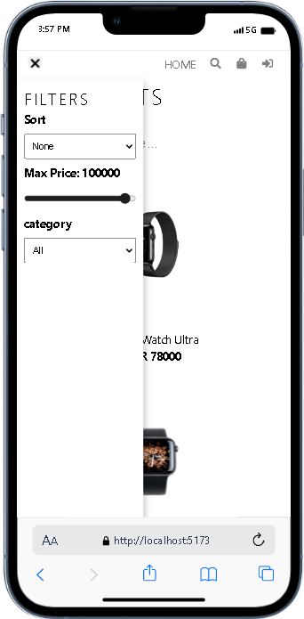
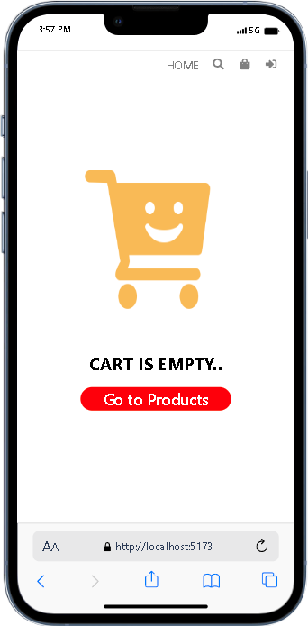
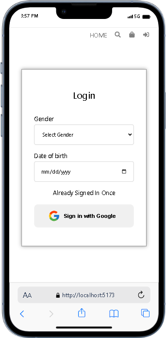
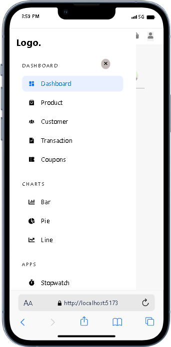
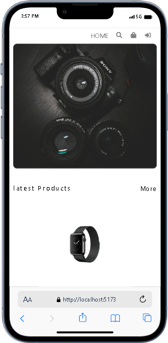
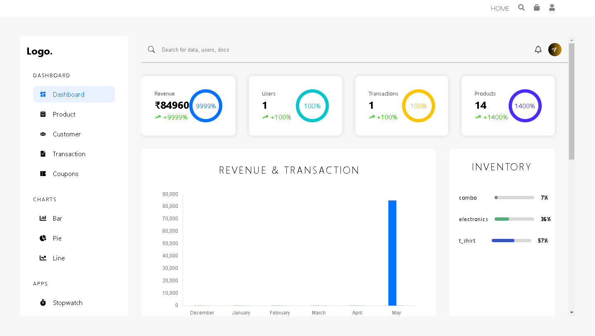
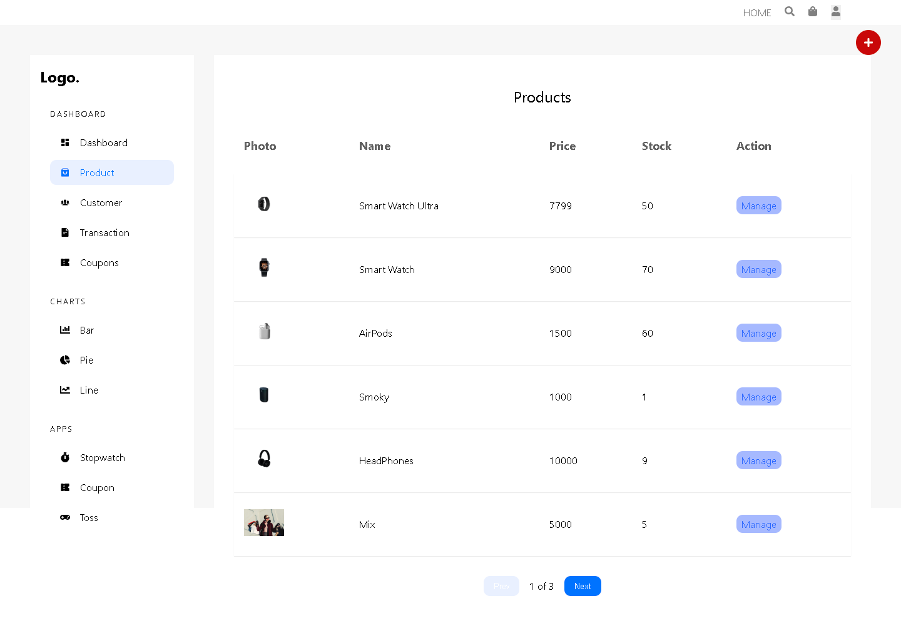
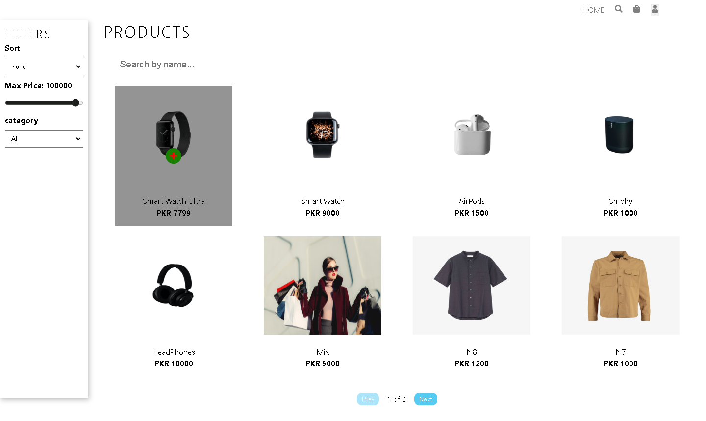

# Mern Shop Using sass

MERN Shop is a web application built with React.js for the frontend, utilizing Vite as the build tool. It integrates Stripe for payment processing, Firebase for authentication (including Google login), and MongoDB as the database for storing product data.

### Mern Shop

Its full Mern Website that's include Dummy Data for checking or also inlcude filtering Data sends updates fully Crud Functionality using this stack.I also use a firebase authentication for Authorization and also man more the main thing is that i learn and use sass its my best practicing among sass.

## Features

- **React.js with Redux Toolkit**: Utilizes Redux Toolkit for state management.
- **Firebase Authentication**: Implements Firebase authentication for user management, including Google login.
- **Stripe Integration**: Allows users to make payments securely using Stripe.
- **MongoDB Database**: Stores product data in MongoDB for CRUD operations.
- **RTK Query**: Utilizes Redux Toolkit Query for efficient API calls.
- **CRUD Operations**: Full CRUD functionality for managing products.

## Demo

## [](https://mern-shop-frontend.onrender.com/)

# Tech Stack

- : A JavaScript library for building user interfaces.
- : React rendering library for web applications.
- : Official, opinionated, batteries-included toolset for efficient Redux development.
- : Official React bindings for Redux.
- : Declarative routing for React applications.
- : Promise-based HTTP client for the browser and Node.js.
- : Platform for building web and mobile applications.
- : Payment processing platform.
- : Simple yet flexible JavaScript charting for designers & developers.
- : React wrapper for Chart.js 2.
- : Parse, validate, manipulate, and display dates and times in JavaScript.
- : Lightweight, fast, and extendable data grid for React.
- : Icon library for React.
- : React notifications library.
- : CSS extension language.

- **Frontend**:

  - React.js
  - Vite
  - Redux Toolkit
  - Firebase Authentication
  - Stripe
  - RTK Query

- **Backend**:
  - Node.js
  - Express.js
  - MongoDB

```bash
VITE_FIREBASE_API_KEY=""
VITE_FIREBASE_APP_ID=""
VITE_FIREBASE_AUTH_DOMAIN=""
VITE_FIREBASE_MEASUREMENT_ID=""
VITE_FIREBASE_MESSAGING_SENDER=""
VITE_FIREBASE_PROJECT_ID=""
VITE_FIREBASE_STORAGE_BUCKET=""
VITE_SERVER_URL=""
VITE_SERVER_VERSION=""
VITE_STRIPE_KEY=""
```

**Project Images**

- [Download recording.mp4](./ShowCase/recording.mp4)


https://github.com/AliHamza0007/Mern-Shop-Frontend/assets/141808379/a8d9023c-2687-4d68-9c59-427e4bd58fb8


<div class="d-flex">











</div>

## Contributing

Contributions are welcome! If you'd like to contribute to this project, feel free to open an issue or submit a pull request.

## License

This project is licensed under the [MIT License](LICENSE).

---

## Feel free to customize the content according to your specific project details and requirements.
